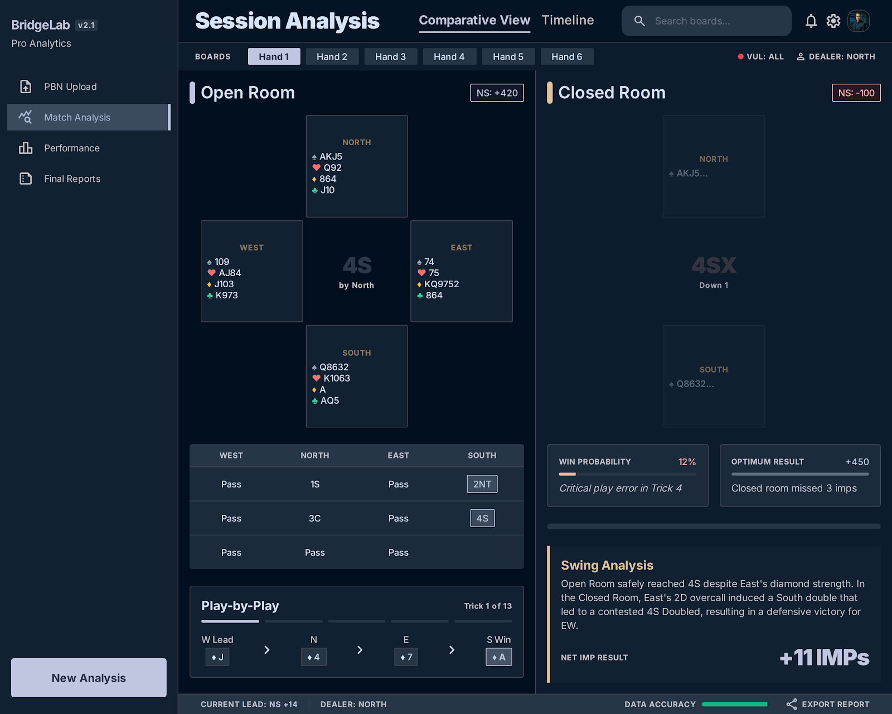

# Bridge Match Analyzer

Un analizador de partidas de Bridge profesional basado en Python que utiliza Double Dummy Solver (DDS) para evaluar el desempeño técnico en subasta y carteo.



## ✨ Características
- **Análisis de Subasta:** Compara el contrato alcanzado contra el Par Score óptimo de la mano.
- **Análisis de Carteo:** Rastrea el cambio en bazas esperadas carta a carta, atribuyendo la ganancia/pérdida de puntos al jugador responsable.
- **Interfaz Moderna:** UI oscura de alto contraste con visualización dinámica del desarrollo de la mano.
- **Soporte de Formatos:** Compatible con archivos `.pbn` y `.lin`.
- **Informes Exportables:** Genera reportes técnicos detallados en Excel con atribución de IMPs por equipo y jugador.

## 🚀 Instalación
Asegúrate de tener Python 3.10+ instalado. Se recomienda el uso de `uv` para la gestión de dependencias.

```bash
# Clonar el repositorio
git clone https://github.com/tu-usuario/bridge-match-analyzer.git
cd bridge-match-analyzer

# Instalar dependencias
uv sync
```

## 💻 Uso
### Interfaz Web (Recomendado)
Inicia el servidor local y accede a la herramienta desde tu navegador:
```bash
uv run python app.py
```
Navega a `http://localhost:8000`.

### Línea de Comandos (CLI)
Para un análisis rápido y generación de Excel:
```bash
uv run python main.py sala_abierta.pbn sala_cerrada.pbn
```

## 🛠️ Tecnologías
- **Backend:** FastAPI, Python 3.12
- **Lógica de Bridge:** `endplay` (DDS integration)
- **Frontend:** HTML5, Tailwind CSS, JavaScript (Vanilla)
- **Datos:** Pandas, OpenPyXL

## ⚖️ Lógica de Puntuación
- **Puntos de Subasta:** `Puntuación Potencial del Contrato - Puntuación Par`.
- **Puntos de Carteo:** Suma de `Δ Puntuación de Bridge Esperada` tras cada carta jugada.
- **Atribución:** Los puntos se asignan al jugador que realiza la acción (el declarante es responsable de las cartas del muerto).
